# SYMPTOSENSE - System Architecture Diagrams

## 🏗️ Complete System Architecture

## 🔄 User Data Flow Diagram

```mermaid
flowchart TD
    A[👤 User Visits Website] --> B{Input Method?}
    
    B -->|Text| C[📝 Type Symptoms<br/>e.g. 'itching, cough, fever']
    B -->|Voice| D[🎤 Speech Recognition<br/>Web Speech API]
    
    C --> E[🔧 Symptom Processing]
    D --> E
    
    E --> F[✅ Input Validation<br/>& Autocorrect]
    F --> G{Valid Symptoms?}
    
    G -->|No| H[❌ Error Message<br/>'Please enter valid symptoms']
    G -->|Yes| I[🧮 Feature Vector Creation<br/>132-dimensional binary array]
    
    I --> J[🤖 Random Forest Model<br/>95.12% Accuracy<br/>100 Decision Trees]
    
    J --> K[🎯 Disease Prediction<br/>41 Possible Conditions]
    
    K --> L[📊 Recommendation Engine]
    
    L --> M[💊 Medications]
    L --> N[🥗 Diet Plans]
    L --> O[🏃‍♂️ Workouts]
    L --> P[⚠️ Precautions]
    L --> Q[📖 Disease Info]
    
    M --> R[📱 Results Display<br/>Modal Interface]
    N --> R
    O --> R
    P --> R
    Q --> R
    
    R --> S[👨‍⚕️ User Reviews Results]
    S --> T{Satisfied?}
    
    T -->|No| U[🔄 Try Different Symptoms]
    T -->|Yes| V[📞 Contact Form<br/>Optional Feedback]
    
    U --> B
    V --> W[📧 Email Notification<br/>Auto-Response]
    
    H --> B
    
    %% Styling
    style J fill:#00bcd4,stroke:#fff,stroke-width:3px,color:#000
    style K fill:#4CAF50,stroke:#fff,stroke-width:2px,color:#000
    style R fill:#FF9800,stroke:#fff,stroke-width:2px,color:#000
    style A fill:#9C27B0,stroke:#fff,stroke-width:2px,color:#fff
```

## 📊 Performance Metrics Visualization

## 🏗️ Technical Stack Architecture

## 📱 Component Interaction Diagram

## 🔧 How to Use These Diagrams

### For Documentation:
1. Copy the Mermaid code blocks
2. Paste into any Mermaid-compatible editor
3. Export as PNG/SVG for presentations

### For GitHub README:
- GitHub automatically renders Mermaid diagrams
- Simply include the code blocks in your README.md

### For Presentations:
1. Use online Mermaid editors like:
   - https://mermaid.live/
   - https://mermaid-js.github.io/mermaid-live-editor/
2. Export as high-resolution images
3. Include in PowerPoint/Google Slides

### For Academic Papers:
- Export as SVG for vector graphics
- Use in LaTeX documents
- Include in research publications

## 📥 Download Instructions

To download these diagrams as images:

1. **Visit Mermaid Live Editor**: https://mermaid.live/
2. **Copy and paste** any of the diagram codes above
3. **Click "Download PNG"** or "Download SVG"
4. **Save** to your desired location

## 🎨 Color Scheme

The diagrams use SYMPTOSENSE brand colors:
- **Primary Blue**: #00bcd4 (Cyan)
- **Success Green**: #4CAF50
- **Warning Orange**: #FF9800
- **Error Red**: #F44336
- **Purple**: #9C27B0

## 📊 Diagram Legend

- **Rectangles**: Processes/Components
- **Diamonds**: Decision Points
- **Cylinders**: Databases/Storage
- **Solid Arrows**: Data Flow
- **Dotted Arrows**: Optional/Conditional Flow
- **Colored Boxes**: Key Components (ML Model, UI, etc.)
